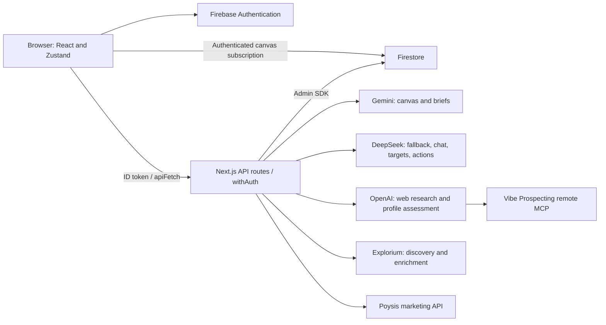

# Bezalel infrastructure

Repository audit: 2026-09-22. This describes the checked-out application, not a verified inventory of the deployed cloud account.

## Runtime and boundaries

The application lives in `bezalel/`: Next.js 15.3.8 App Router, React 19, JavaScript, MUI, and Zustand. Next.js serves pages and API route handlers from the same application. Firebase Authentication identifies users; Firestore stores documents and listens for canvas updates. Firebase Admin runs on the server with REST-preferred Firestore transport.



Site metadata references `bezalel-web-client.vercel.app`; deployment settings, active release, regions, function limits, DNS, and billing were not inspected. No infrastructure-as-code, scheduler, queue worker, Firestore rules/index definitions, or CI workflow is checked into this repository.

## Authentication and data ownership

All current API HTTP handlers are wrapped by `src/app/lib/withAuth.js`. The browser's `src/firebase/apiFetch.js` attaches a Firebase ID token. The server verifies the token and rejects mismatched `userId` claims in query parameters or JSON bodies before database access or provider calls. Legacy context and pitch-deck handlers use the verified identity rather than fixed user IDs. Unsigned calls return 401; cross-user claims return 403; invalid JSON bodies return 400. External API clients must now send `Authorization: Bearer <Firebase ID token>`.

Token verification uses Firebase's normal signature/expiry checks, without a per-request revocation lookup. Direct browser Firestore access still depends on deployed Firestore security rules; API protection does not replace those rules. Their deployed contents were not available for this audit. See [Firebase token verification](https://firebase.google.com/docs/auth/admin/verify-id-tokens).

Provider credentials are server environment variables shared by the deployment. There is no per-user provider-account mapping or application-level spending/rate-limit enforcement. In particular, authenticated access to the Poysis proxy is not equivalent to per-user Poysis resource isolation; define that policy before opening this to multiple independent customers.

## Persistence

| Path | Contents |
| --- | --- |
| `users/{uid}` | Firebase user profile |
| `users/{uid}/documents/{documentId}` | Title, timestamps, business context, compact chat memory |
| `.../documents/{documentId}/canvasSegments/{ideaId}` | Generated idea, decision status, priority, research |
| `.../documents/{documentId}/chat/{messageId}` | Chat role, content, timestamp, optional reasoning |
| `users/{uid}/canvasSegments/{ideaId}` | Legacy canvas data used by older segment/pitch-deck code |
| `contexts/{contextId}` | Legacy onboarding context with user ID |

The document page restores metadata and ideas through its API, then subscribes to that document's canvas collection. Cached empty snapshots cannot erase restored state. Navigation tears down the listener and cancels the load. User changes clear in-memory document and canvas state. Document lists are fetched on `/documents`, not redundantly on every signed-in page.

Document deletion uses Firestore `recursiveDelete` to remove all descendants, including chat; clearing chat recursively deletes the chat collection before clearing memory. This avoids a single large write batch and orphaned chat records. Recursive deletion is not an atomic transaction: partial failure requires retry. See [Firestore recursiveDelete](https://googleapis.dev/nodejs/firestore/latest/Firestore.html#recursiveDelete).

Document lists and chat history are still loaded in full. Pagination is the next scaling step if measured collection sizes justify it. Onboarding preferences persist locally through Zustand. Studio inbox entries, drafts, published items, and opportunity results are browser state rather than durable records.

## External work and limits

| Work | Provider and current behavior | Application deadline |
| --- | --- | --- |
| Canvas/brief generation | Gemini `gemini-3.5-flash`; `pro` alias maps to `gemini-3.1-pro-preview`; DeepSeek fallback | 60 seconds per provider attempt; up to 120 seconds for fallback chain |
| Chat | DeepSeek `deepseek-v4-flash`, streaming; memory refresh after response | 120 seconds for provider stream; 30 seconds for memory request |
| Canvas-action inference / target generation | DeepSeek JSON responses | 60 seconds; cancellation follows request |
| Idea research | OpenAI `gpt-4o-mini` with web search | 120 seconds; SDK retries disabled |
| Opportunity research | Explorium, Bezalel web search, or Vibe MCP; maximum five visible profiles | 270 seconds end-to-end; route declares 300 seconds |
| Poysis marketing / rule preview | Server-side read/preview proxy | 30 seconds |

Opportunity orchestration defaults to `gpt-4.1-mini`; the legacy ICP-to-filter step defaults to `gpt-4o-mini`. Explorium discovers up to five prospects before sequential enrichment/assessment. Streaming publishes completed profiles as they arrive, with 15-second heartbeats. Cancellation reaches provider calls, and failures retain already received results. No automated rerun or cross-run contact deduplication exists yet.

Chat SSE parsing preserves partial JSON and UTF-8 across chunks, recognizes completion, rejects malformed/truncated provider streams, and releases readers on cancellation. Chat and export panels and the opportunity view load on demand to reduce initial document JavaScript.

These deadlines bound provider work, not every Firestore operation or the hosting platform's own request limit. Configure hosting limits to accommodate the required routes. Provider work submitted before cancellation may still be charged. Model access and provider credits require live verification. SDK retries can extend request waits, so explicit retry/deadline choices matter; see [official OpenAI timeout guidance](https://developers.openai.com/api/docs/guides/flex-processing#api-request-timeouts).

## Configuration

Use `bezalel/.env.local` locally and the host's secret configuration in deployment. Next.js loads environment files; server modules do not load them a second time. Never place provider secrets in `NEXT_PUBLIC_*` variables.

| Variables | Purpose |
| --- | --- |
| `NEXT_PUBLIC_FIREBASE_API_KEY`, `NEXT_PUBLIC_FIREBASE_AUTH_DOMAIN`, `NEXT_PUBLIC_FIREBASE_PROJECT_ID`, `NEXT_PUBLIC_FIREBASE_APP_ID` | Browser Firebase configuration; baked into the client build |
| `NEXT_PUBLIC_FIREBASE_STORAGE_BUCKET`, `NEXT_PUBLIC_FIREBASE_MESSAGING_SENDER_ID`, `NEXT_PUBLIC_FIREBASE_MEASUREMENT_ID` | Additional Firebase client configuration; no active storage/messaging/analytics flow verified |
| `FIREBASE_PROJECT_ID`, `FIREBASE_CLIENT_EMAIL`, `FIREBASE_PRIVATE_KEY` | Required core Firebase Admin service-account fields; escaped private-key newlines are normalized |
| `FIREBASE_TYPE`, `FIREBASE_PRIVATE_KEY_ID`, `FIREBASE_CLIENT_ID`, `FIREBASE_AUTH_URI`, `FIREBASE_TOKEN_URI`, `FIREBASE_AUTH_PROVIDER_X509_CERT_URL`, `FIREBASE_CLIENT_X509_CERT_URL`, `FIREBASE_UNIVERSE_DOMAIN` | Additional service-account fields consumed by current configuration |
| `GEMINI_API_KEY` | Primary canvas/brief generation |
| `DEEPSEEK_API_KEY`, optional `DEEPSEEK_MODEL` | Chat, targets, action inference, canvas fallback; model override currently applies only to fallback |
| `OPENAI_API_KEY` | Idea research and opportunity orchestration |
| `OPPORTUNITY_RESEARCH_MODEL`, `OPPORTUNITY_SCORING_MODEL` | Optional opportunity model overrides |
| `EXPLORIUM_API_KEY`, optional `EXPLORIUM_API_URL` | Explorium connection; default `https://api.explorium.ai` |
| `VIBE_ACCESS_TOKEN` | Separate Vibe OAuth credential for its remote MCP server |
| `POYSIS_API_TOKEN` or `POYSIS_API_KEY`, optional `POYSIS_API_URL` | Marketing connection; default `https://api.poysis.com` |

## Connected, prototype, and planned features

- **Implemented integrations:** document CRUD/context/canvas decisions, canvas generation with fallback, document chat/history, business brief generation, idea research, opportunity provider pipeline, and Poysis API proxy. Local tests do not prove production credentials or upstream availability.
- **Prototype:** studio sample inbox/evidence, generated artifact progress, publishing, voice transcription, and automation screens. Publishing changes local state; transcription inserts sample text. MarketingView exists but is not currently mounted by StudioApp.
- **Legacy:** `/segments`, onboarding, and pitch-deck code still reference older canvas/context paths. Some legacy mutation callers omit the document ID now required by the document API. These flows need migration or retirement; the supported work path for validation is `/documents` → `/document/{id}`.
- **Not connected:** optional `workspaceMode` chat points at `/api/workspace-chat`, which does not exist and is not enabled by current document-page callers.
- **Roadmap only:** document/activity bento navigation, recursive feedback classification, Grokbot/X listening, recurring 15-minute Grokbot jobs, and 12-hour Explorium contact delivery. There is no background scheduling infrastructure yet.

## Run and verify

Run from `bezalel/` with dependencies installed and Firebase environment configured:

```sh
npm ci
npm test
npm run lint
npm run build
npm start
```

Use `npm run dev` for development. Do not run a development server and production build against the same `.next` directory at once.

The regression suite covers document refresh, cached snapshots, API authentication/ownership, browser token forwarding, deletion failure propagation, provider routing and result caps, and fragmented/interrupted streams. Production build and local HTTP checks are recorded in `MAINTENANCE.md`.

Before declaring the deployed product fully verified: exercise sign-in and account switching with two users; create/rename/reload/delete a disposable document; generate and update a canvas idea; stream/stop/reopen/clear chat; run one small authorized provider request per integration; verify deployed Firestore rules and function deadlines. Review production logs for failures without logging credentials. No deployed resources or real user records were changed during this repository maintenance pass.
